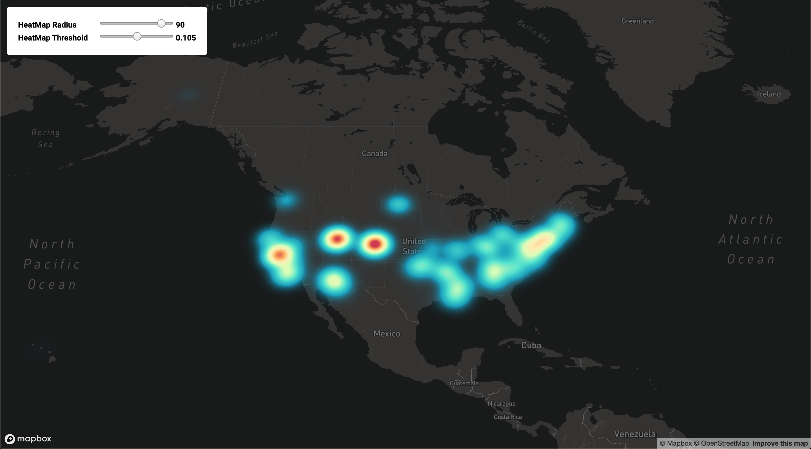

# BDAD Final Project
## Quantifying the Environmental Impact of Fossil Fuel Demand

# Requirements

This project is built using [SBT] using **Scala 2.11**
and **Spark 2.4.0**

    libraryDependencies += "org.apache.spark" % "spark-core_2.11" % "2.4.0"
    libraryDependencies += "org.apache.spark" % "spark-sql_2.11" % "2.4.0"
    libraryDependencies += "org.apache.spark" % "spark-mllib_2.11" % "2.4.0"
    libraryDependencies += "org.apache.hadoop" % "hadoop-common" % "3.2.0"
    
    libraryDependencies += "org.apache.commons" % "commons-math3" % "3.6"
    
[SBT]: https://www.scala-sbt.org
# Acquiring Data

**WARNING**: AirData is 350 GB + in size, and this project assumes that
it is on HDFS.

## EPA AirData

Please consult the Python scripts and README file in `scripts/airdata`

## EIA Oil and Gas

Please consult the Python script and the README file in `scripts/petroleumdata`
    
# Running

The `Main` class can be run (and a number of analytics can be performed)
on **Dumbo** using our `submit.sh` script. To do so, from the root directory
of this project on **Dumbo**:

1. **Download Airdata and EIA Oil & Gas**: See "Acquiring Data"
2. **Configure Dumbo Environment**: `source modload.sh`
3. **Build the project**: `sbt package`
4. **Submit to the cluster**: `./submit.sh`
5. **(Optional) Run `spark-shell` with our libraries**: `./spark-shell.sh`
    
# About the Data: AirData
This project has a number of functions to explore the EPA's AirData data
set. This set was collected from the mid 1980s up to present day (2019)
at the **hourly** level. It includes atmospheric factors such as
**criteria gasses** (Ozone, NO2, CO, Sulfur) and **particulate matter**.

The total size of the dataset is over **350 GB**. For the purpose of our
analysis, we have constrained our set to just the Criteria Gasses from 2014
to 2019. However, this codebase **supports using the entire dataset.**

# About the Data: Oil and Gas

**TODO**

# Package Layout: `etl`

## `Scenarios`
 
Analysis of data sets defined by the `bdad.etl.Scenarios`
package are available in `doc/`. This includes a more
in-depth look at the underlying signal(s) within the
scenario.

Currently this is defined for the Criteria Gasses
(2014-2019) data set. It also supports quick loading
of these Scenarios such that the `etl.airdata` routines 
need not be invoked more than once. This greatly sped
up our analysis.

## `etl.airdata`

This package controls making AirData subsets by specifying
the required features and date range. All loading
and cleaning is handled by this package, and done so efficiently
such that only the required data is loaded into memory.

# Package Layout: `model`

## `TLCC`

The TLCC package, or "Time Lagged Cross Correlation"
implements a new time series library written by scratch
in pure Spark. Datasets are validated and loaded via
the `TLCCIngress` class.

The `TLCC.TLCC` class implements an All-play-All cross
correlation strategy. That is, one `DataFrame` is provided
as the "anchor" columns (for us, this is the Oil and Gas data),
and another is provided as the "test" columns. 

Also provided is a list of lags. The "test" columns are slid
forwards or backwards for each positive and negative, respectively,
lag. These are then compared to each and every "anchor" column
by computing the cartesian product between the "test" and "anchor"
columns.

For illustration and functionality testing purposes, we implement a 
auto-correlation of the air data with itself as well as the correlation 
between the air data and the oil (petroleum) data.

## `Heatmap`

The `Heatmap` package provides the input to our Visualization.
It computes the total "pollution badness" by taking the **L2 Norm**
of the normalized **Criteria Gasses** features at each Latitude/Longitude
pair for a given year.

## `Heatmap`: "Pollution Dollars" **(TODO)**

# UI

## `HeatMap Viz` UI

The `webapp` directory contains a lightweight web application built to visualize the data outputted from our analytics.
Please consult the specialized [README](webapp/README.md) file for the web app for directions on how to run it locally.

The app spins up a `Node` server and serves a UI powered by `viz.js`, a script that handles reading of data, viz layer
creation, as well as handling input. See the `Heatmap` subsection of the `Package Layout` section above on how the data is 
generated by our Spark analytic. 

Visualizations are done with [deck.gl], a powerful, open-source big data viz framework built on top of WebGL. The viz layers support
large amounts of rows and can efficiently re-render at will. There is a small UI for controlling the rendering parameters of the heatmap,
and the geo-map layer is a fully interactive map where one can zoom in/out to se
As mentioned in the above section on `Heatmap` data generation, the `.csv`
written to disk only needs two columns for `lon`, `lat` that the `viz.js` script can read to build up the data layers.

[deck.gl]:https://deck.gl/#/

Example HeatMap Visualization (web app running on `localhost:8080`):

