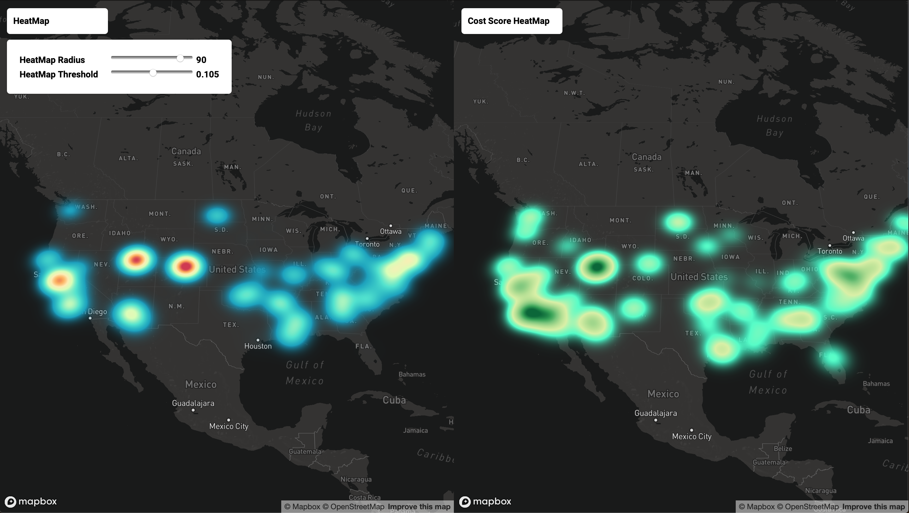

# Quantifying the Environmental Impact of Fossil Fuel Demand

# Requirements

This project is built using [SBT] using **Scala 2.11**
and **Spark 2.4.0**

    libraryDependencies += "org.apache.spark" % "spark-core_2.11" % "2.4.0"
    libraryDependencies += "org.apache.spark" % "spark-sql_2.11" % "2.4.0"
    libraryDependencies += "org.apache.spark" % "spark-mllib_2.11" % "2.4.0"
    libraryDependencies += "org.apache.hadoop" % "hadoop-common" % "3.2.0"
    
    libraryDependencies += "org.apache.commons" % "commons-math3" % "3.6"
    
[SBT]: https://www.scala-sbt.org

# Acquiring Data

**WARNING**: AirData is 350 GB + in size, and this project assumes that
it is on HDFS.

## EPA AirData

Please consult the Python scripts and README file in `scripts/airdata`

**Reproducability**: The exact `meta.json` output for our AirData analysis is as follows:

    {
        "gasses": [
            "ozone",
            "so2",
            "co",
            "no2"
        ],
        "meteorological": [
            "Winds",
            "Temperature",
            "Barometric Pressure",
            "RH and Dewpoint"
        ],
        "num_datasets": 680,
        "particulates": [
            "PM2.5_FRM-FEM Mass",
            "PM2.5_non_FRM-FEM Mass",
            "PM10_Mass",
            "PM2.5_Speciation",
            "PM10_Speciation"
        ],
        "size_decompressed": "392GB",
        "time_downloaded": "2019-10-17 17:48:37.885537",
        "time_granularity": "hourly",
        "time_to_download": 0.31,
        "toxics": [
            "HAPs",
            "VOCs",
            "NONOxNOy",
            "Lead"
        ]
    }

This is given by the script in `scripts/airdata`. The latest date considered by our analysis (for Ozone specifically) is **May 29th, 2019**.
At the time of our writing, this was the latest information available from the EIA. The data for all of 2019 can be gathered using our
provided script.

## EIA Oil and Gas

Please consult the Python script and the README file in `scripts/petroleumdata`.
The latest date considered by our analysis (for Ozone specifically) is **November 22nd, 2019**.
    
# Running

The `Main` class can be run (and a number of analytics can be performed)
on **Dumbo** using our `submit.sh` script. To do so, from the root directory
of this project on **Dumbo**:

1. **Download Airdata and EIA Oil & Gas**: See "Acquiring Data"
2. **Configure Dumbo Environment**: `source modload.sh`
3. **Build the project**: `sbt package`
4. **Submit to the cluster**: `./submit.sh`
5. **(Optional) Run `spark-shell` with our libraries**: `./spark-shell.sh`
    
# About the Data: AirData
This project has a number of functions to explore the EPA's AirData data
set. This set was collected from the mid 1980s up to present day (2019)
at the **hourly** level. It includes atmospheric factors such as
**criteria gasses** (Ozone, NO2, CO, Sulfur) and **particulate matter**.

The total size of the dataset is over **350 GB**. For the purpose of our
analysis, we have constrained our set to just the Criteria Gasses from 2014
to 2019. However, this codebase **supports using the entire dataset.**

# About the Data: PetroleumData
The data for Oil (Petroleum) is represented by a timeseries of spot prices from the EIA dataset
for crude oil. The data from EIA contains various metrics ranging from imports/exports
to futures and spot prices. Spot prices are chosen due to the simple representation, daily granularity, and 
since they intuitively help us best quantify what demand might mean, since it is the price someone is 
willing to pay for the resource on the current market.

Similar to the `AirData` in the previous section, for the purpose of our testing and analysis, we have
constrained our dataset to spot price from 2014 to 2019 or to exclusively those from year 2019.

# Package Layout: `etl`

## `Scenarios`
 
Analysis of data sets defined by the `bdad.etl.Scenarios`
package are available in `doc/`. This includes a more
in-depth look at the underlying signal(s) within the
scenario.

Currently this is defined for the Criteria Gasses
(2014-2019) data set. It also supports quick loading
of these Scenarios such that the `etl.airdata` routines 
need not be invoked more than once. This greatly sped
up our analysis.

## `etl.airdata`

This package controls making AirData subsets by specifying
the required features and date range. All loading
and cleaning is handled by this package, and done so efficiently
such that only the required data is loaded into memory.

## `etl.petroleumdata`

This package controls making and processing PetroleumData datasets by specifying date ranges, 
adding and removing columns based on use case, etc. This package handles the loading of the 
petroleum data and creation of new columns.

# Package Layout: `model`

## `TLCC`

The TLCC package, or "Time Lagged Cross Correlation"
implements a new time series library written by scratch
in pure Spark. Datasets are validated and loaded via
the `TLCCIngress` class.

The `TLCC.TLCC` class implements an All-play-All cross
correlation strategy. That is, one `DataFrame` is provided
as the "anchor" columns (for us, this is the Oil and Gas data),
and another is provided as the "test" columns. 

Also provided is a list of lags. The "test" columns are slid
forwards or backwards for each positive and negative, respectively,
lag. These are then compared to each and every "anchor" column
by computing the cartesian product between the "test" and "anchor"
columns.

For illustration and functionality testing purposes, we implement a 
auto-correlation of the air data with itself, correlation 
between the air gas data and the oil (petroleum) data, and finally correlation
between the air toxics data and petroleum data.

## `Heatmap`

The `Heatmap` package provides the first input to our Visualization.
It computes the total "pollution badness" by taking the **L2 Norm**
of the normalized **Criteria Gasses** features at each Latitude/Longitude
pair for a given year.

## `CostRepresentation` (Actuation, Remediation)

The `CostRepresentation` package contains the second input to our Visualization - cost
score metrics per longitude/latitude pair. 

Given the results found from our TLCC analysis (See section on `model.TLCC` for 
implementation details), we now deduce a scoring measure for any given region
with the current petroleum spot price(s) and past air quality data. We first
define a measure of overall pollution as the L2 Norm of each (normalized) criteria
gas moving averages for a given latitude/longitude pair, on a given day.

Before computing the L2 norm,
the air quality moving averages are computed by taking the Simple Moving Average
(SMA) over `n` periods, where `n` is the best lag experimentally found from the TLCC analysis.
We assume this final value to be the _magnitude of increasing pollution_.

This scalar is then divided by the petroleum spot price for the current
day to get the dollar-impact of pollution. If there
are multiple petroleum prices considered, they are again the L2 Norm of the
normalized price signals. We consider this the _magnitude of current demand_.


### Local Pollution Scoring Measure
Let `X := Criteria Gas signals by Time and Location`

Let `X_SMA_n := SMA of X over n periods`

Let `Y := Petroleum Price signals by Time` (for each Location)

Then,
```
for each row i in X and Y:
    score := X_SMA_n_i / Y_i
```

We consider this final score to model the magnitude of an increase in environmental damage
per unit of current demand.


Using this score for a region, we can deduce the trend of the overall scoring
signal for a given area of interest by computing the historical scores for that
area. Moreover, one can compare regions by energy demand using this measure by
comparing their scores. Notice that this is the same as comparing the regions
by the pollution values themselves, since the numerator of the score is the
same for all regions. 

# UI

## `HeatMap Viz`

The `webapp` directory contains a lightweight web application built to visualize the data outputted from our analytics.
Please consult the specialized [README](webapp/README.md) file for the web app for directions on how to run it locally.

The app spins up a `Node` server and serves a UI powered by `viz.js`, a script that handles reading of data, viz layer
creation, as well as handling input. See the `Heatmap` and `CostRepresentation` subsections of the `Package Layout` section
above on how the data is generated by our Spark analytics. 

Visualizations are done with [deck.gl], a powerful, open-source big data viz framework built on top of WebGL. The viz layers support
large amounts of rows and can efficiently re-render at will. There is a small UI for controlling the rendering parameters of the heatmap,
and the geo-map layer is a fully interactive map where one can zoom in/out to see more local features of the heatmap in finer detail. 

As mentioned in the above section on `Heatmap` data generation, the `.csv`
written to disk only needs two columns for `lon`, `lat` that the `viz.js` script can read to build up the data layers. The data from
`CostRepresentation` is rendered differently, by utilizing three columns outputted by the analytic:
`lon`, `lat`, and `score`. The visualization and UI builds a heatmap by using the `lon`, `lat`
columns for location data and the `score` column for the weight.

[deck.gl]:https://deck.gl/#/

Example HeatMap Visualization with both `HeatMap` and `CostRepresentation HeatMap` (web app running on `localhost:8080`):



# Contributions
**Andrii: Petroleum Data and Webapp**

`webapp`, `model.CostRepresentation`, `etl.petroleumdata`, `scripts/petroleumdata`, `etl.Scenarios` (petroleum)

**Cole: AirData and Supporting Files**

`build.sbt`, `etl.util`, `model.TLCC`,`model.Heatmap`, `etl.airdata`, `etl.Scenarios` (pollution)
